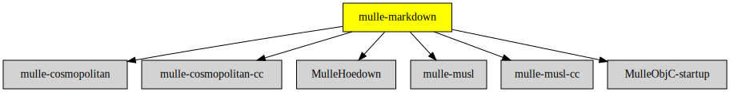

# mulle-markdown

#### 👯 mulle-markdown turns markdown into HTML

**mulle-markdown** uses the [hoedown](//github.com/hoedown/hoedown)
library wrapped into [MulleHoedown](//github.com/MulleWeb/MulleHoedown) to
convert [Markdown](//en.wikipedia.org/wiki/Markdown) into
[HTML](https://en.wikipedia.org/wiki/HTML).

This is a smallish showcase of how to compile mulle-objc with musl into a
standalone static executable.

## Usage

```console
   mulle-markdown [options]

   Reads markdown from stdin, writes it to stdout.

Options:
   -w : wrap with HTML header and footer
   -c : emit link to "style.css"
```

## Example

```console
echo "# hello" | mulle-markdown -c
```

emits

```html
<html>
<head>
<link rel="stylesheet" src="style.css">
</head>
<body>
<h1>hello</h1>
</body>
</html>
```

> ### Note
>
> mulle-markdown does not pretty print the resulting HTML. You may want to
> chain it with mulle-tidy for nicer output.


### You are here




## Build

This is a [mulle-sde](https://mulle-sde.github.io/) project.

It comes with its own virtual environment and list of dependencies.
To fetch and build everything say:

```
mulle-sde craft
```
